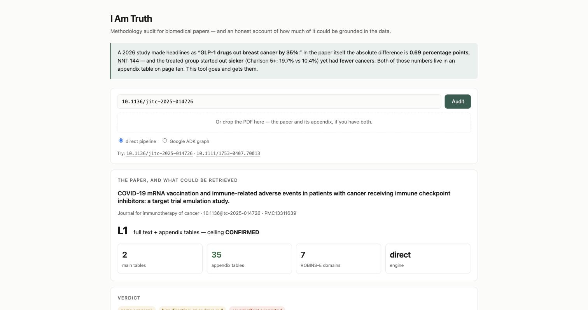
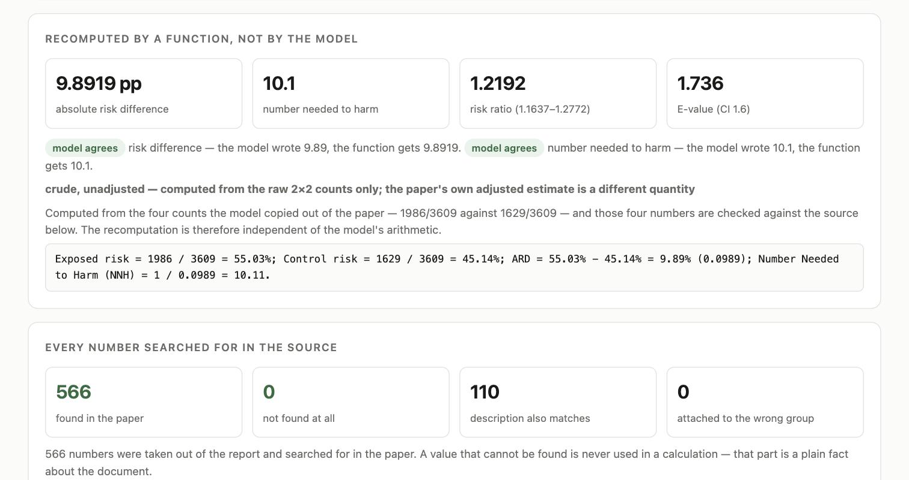
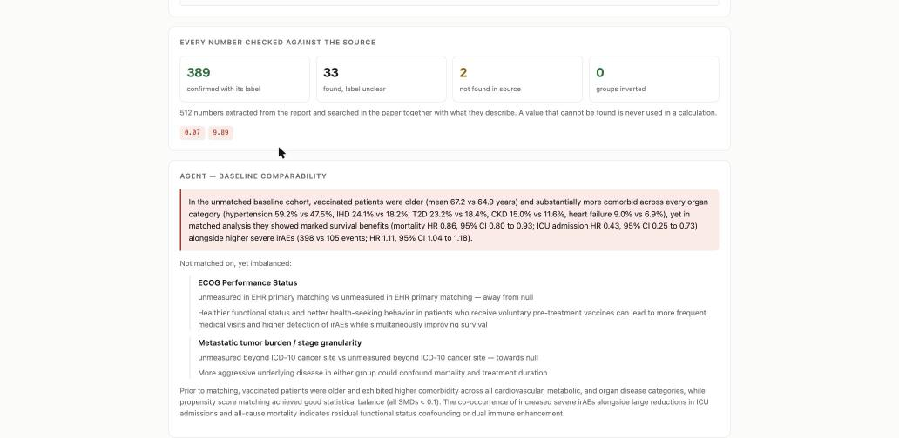
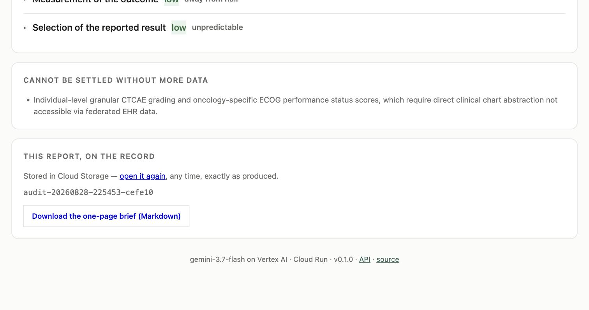
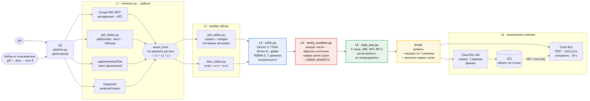

# I Am Truth · Я Правда

**An agent that audits the methodology of biomedical papers — and reports how much of
that audit it was actually able to ground in the data.**

Submission to the Google **All Things Agentic Hackathon** (deadline 01.09.2026, 02:00 CEST).

> Working documentation in `docs/` is written in Russian; this README, the architecture
> diagram and the submission text are in English.

---

## The claim this project makes

A critical prompt is not a product. Anyone can copy one.

What is hard — and what we measured — is **forcing the retrieval of full text and, above
all, appendix tables**. The same model, the same prompt, the same temperature, three
different inputs:

| Input | What the model can see | Score, 3 runs | Median |
|---|---|---|---|
| abstract only | title, abstract, metadata | 4.0 · 3.5 · 4.0 | **4.0 / 6** |
| full text, no appendices | Tables 1–5, authors' own caveats | 4.5 · 5.0 · 4.0 | **4.5 / 6** |
| full text **+ appendix tables** | Appendix Tables 1–2 | 5.0 · 6.0 · 6.0 | **6.0 / 6** |

Scored by an LLM judge against a six-point expert reference, temperature 0,
`gemini-3.7-flash`, the same ROBINS-E prompt that runs in production.

The gap between the first row and the last is positive in **every** run (+1.0, +2.5,
+2.0). The middle row is not: in one run out of three, the full text gave nothing over
the abstract. So the honest statement is not "each step up helps a little" — it is
**the appendix is where the audit becomes real**.

**And the honest caveat.** Those three inputs are prepared documents, where the relevant
appendix numbers sit next to each other. Run the same system end-to-end on the
**published 10-page PDF** and a single critic scored **3.5–4.5 / 6 (median 3.5)** across
three runs — lower, because the numbers now have to be *found* before they can be
reasoned about. Adding one narrow sub-agent for baseline comparability took that to
**5.0–6.0 / 6 (median 5.5)**, and the point it was built for went from 0.0 in every run
to 1.0 in every run (F-45).
What survives on the real file is the part that matters most: the appendix imbalance is
caught with the **correct direction** every time, and the verdict matches the human
expert's word for word (`real_association_explained_by_selection`). What does not
survive is the point requiring two distant numbers to be combined — never scored on the
real file, always scored on the prepared one. That gap is the argument for per-domain
sub-agents, and it is written up in `docs/02-verified-facts.md`, F-43.

The interesting part is not the trend. It is the **mechanism**: each level unlocks
exactly those expert points that physically live in it, and no others (`docs/02-verified-facts.md`, F-26).

What the appendix changes is not whether the model sounds right — it is whether anything
it says can be checked. One expert point stays out of reach without it in every run: that
the GLP-1 arm was *sicker* (Charlson 5+: 19.7% vs 10.4%) and yet had *fewer* cancers.
Both numbers sit in an appendix table, ten pages in, and the paradox only exists once
they are put side by side.

---

## Live service

**Open it in a browser — the audit runs from the page:**

```
https://i-am-truth-242136767009.us-central1.run.app
```



Paste a DOI, or drop the PDF and its appendix if the paper is not open. The page reports,
in this order: **the evidence level actually reached** and the confidence ceiling that
follows from it, the verdict, the risk numbers recomputed by a function rather than by the
model, then every number checked against the source, then the two narrow agents, and only
last the seven ROBINS-E domains.

That order is the design. A conclusion should not be readable before the thing that backs
it — which is precisely the failure this tool looks for in other people's papers.

Two more things come out with the report, for the same reason. Every audit is written to
Cloud Storage under a permanent id and can be opened again at `/audits/<id>`, unchanged —
an audit nobody can reopen is an audit nobody can check, and the tool has no standing to
demand reproducibility of other people's papers while producing none of its own. And the
same report is downloadable as a one-page Markdown brief at `/audits/<id>/brief.md`, in
the same order as the page: what the audit stands on, where the bias points by a count of
domains, what the function recomputed, and only then the prose.





> The screenshot predates the evidence-weight layer described below; the live page now
> leads with how many of those finds could not have been chance.



The same audit is available over HTTP:

```bash
URL=https://i-am-truth-242136767009.us-central1.run.app

curl $URL/health          # says whether a key is required: "auth": "key" | "open"

curl -X POST $URL/analyze \
     -H 'Content-Type: application/json' \
     -H "X-API-Key: $TRUTH_KEY" \
     -d '{"doi": "10.1136/jitc-2025-014726"}'
```

**Why there is a key on that one call.** Reading is open — `/audits/<id>`, `/levels` and
every report linked from this page need nothing, because evidence behind a password is
not evidence. Running an audit is closed, because each one is three Gemini calls on
somebody's quota, and a public URL in a public README makes that everyone's decision but
ours. Ask for a key if you want to run one; the stored reports below are readable as
they are. The service also refuses more than two audits at a time (`429`, with
`Retry-After`) — one takes 40 to 130 seconds, and a queue of them exhausts the quota
before it exhausts the container.

That DOI is an open-access paper: the service pulls the JATS full text **and 35 appendix
tables**, runs a seven-domain ROBINS-E assessment across three agents, and looks up every
number it reports in the source. Measured on the live service, 31.08, revision 00016:
**level L1, 2 main tables and 35 from the appendix, 365 numbers looked up — all 365 found
in the paper, none missing**; the absolute risk difference recomputed by a function from
the 2×2 counts (9.8919 pp, NNH 10.1) and agreeing with the model's own figures; the
E-value computed from the paper's own adjusted hazard ratio rather than from the raw
counts (**1.56**); and the whole thing kept at
[`/audits/audit-20260831-094123-0b6344`](https://i-am-truth-242136767009.us-central1.run.app/audits/audit-20260831-094123-0b6344).

Every part of that report also carries a status now — `CONFIRMED`, `SUPPORTED`,
`INDICATIVE` or `UNVERIFIED` — assigned by the rule described under *Evidence levels*
below, not by the model. Measured on revision 00017, the same DOI, 31.08:
[`/audits/audit-20260831-142811-5e0ff7`](https://i-am-truth-242136767009.us-central1.run.app/audits/audit-20260831-142811-5e0ff7)
— **410 numbers looked up, 409 found, one not in the paper at all, 64 carrying six bits
or more and 34 pinned to a cell**, and of the ten parts of the audit **1 confirmed,
3 supported, 6 indicative**. Six of ten resting on numbers the document would contain
anyway is not a flattering line, and it is the point: the tool says which of its own
conclusions it cannot back, instead of averaging them into one reassuring figure.

That same run is also where the direction tally earns its place: the model's overall
verdict came out `away_from_null` while three of its own domains pointed the other way and
only two pointed with it. The report says `contradicts` instead of quietly printing the
verdict.

**What that number does and does not mean — and why "all 566 found" is the wrong headline.**
Finding a number in a paper sounds like proof and mostly is not. Measured on this very
document (341,000 characters): an **invented** value shaped like `12.4` turns up in it
about a third of the time, and an invented two-or-three-digit integer about half the time.
On an abstract, 1% of the time. So the better the retrieval works, the less the bare fact
of a match is worth — which is uncomfortable, because retrieval is this project's whole
thesis.

So each find is now weighed against the document's own numbers: how many distinct values
of that shape it already contains gives the chance of a match, and `−log2` of it gives the
find in bits. In the run above: **365 numbers searched, 365 found, of which 40 carry six
bits or more** — a value that a document this size would not hold by accident. The median
find is worth 1.9 bits.

**And it is worth being exact about what those 40 establish**, because the tempting
sentence here is wrong. Six bits say the value came from *this* paper rather than from
the shape of any paper. They say nothing about whether it means what the audit says it
means — that is a different question, answered by the cell address and the group check,
and both of those cover far less (21 of 365 and 5 of 365 on the run above). Treating
"came from here" as "means what was claimed" would be exactly the substitution this tool
exists to catch.
A number that "would have shown up anyway" now scores zero by measurement rather than by
sitting on a hand-written list of trivial values, and the count of what was searched and
what was found finally agree — they did not before, when numbers were skipped silently and
still counted in the total.

**Where each number actually sits.** 21 of them were pinned to a specific table cell whose
row and column agree with what the model said the number was — an address, not a
resemblance. 331 more sit somewhere in a parsed table without being pinned to one cell,
because the model's label for them is a whole sentence quoting several numbers at once,
and no measure can say which cell each came from. The rest live only in running prose.

**And what each conclusion rests on, separately.** One number for the whole audit hides the
thing that matters, so the report now scores every part on its own. In this run **6 of 10
parts** cite at least one distinctive number — and the four that do not are named, starting
with *Confounding*, the domain the whole verdict leans on. They may still be right; they
rest on general properties of the design, and that is a different kind of claim, so it is
printed rather than averaged away. Nine sentences of the audit's own prose are flagged the
same way — found by walking the text and looking up every number in it, with no second
model asked.

**And when the paper is not open at all, this is what it looks like.**
[`/audits/audit-20260831-094008-1ea21b`](https://i-am-truth-242136767009.us-central1.run.app/audits/audit-20260831-094008-1ea21b)
is a paper Europe PMC holds but does not release the full text for. The service used to
answer such a request with an HTTP 500 — it called an endpoint the documentation reserves
for the open-access subset. It now returns a report that says `L3`, names the reason
(`isOpenAccess=N`) in a retrieval log alongside every other source it tried, and grounds
**2 of 10 parts** instead of 6. Sixteen of the 58 numbers the model wrote are **not in the
abstract at all**, and they are listed. That is the product working, not failing.

These figures have been re-measured three times rather than rewritten, and every time the
reason was a defect in the instrument, not in the audit. First the label of a number was
taken from the JSON path of the model's own answer, so almost nothing could match and the
verifier was nearly blind (F-51). Then the marker of a control group was the bare
substring `control`, which matched `glycemic control` and produced accusations of
inverted groups where no control arm was mentioned at all — 13 of them, now 0 (F-56).
The same rule this project applies to other people's numbers.

### When the paper is not open

What the service actually retrieves on its own is Europe PMC: **27.5%** of papers in
this class, measured on a random sample of 40 (F-25). A second channel — publisher PDFs
where the publisher offers a machine-readable pointer — would bring that to roughly 55%,
and it is **not implemented**; the 55% figure describes what is reachable, not what this
service does. The rest sits behind Cloudflare or a publisher's TDM token, and we do not
work around site protection. But a paper unavailable to a script is usually available to
a person, so it can be handed over directly:

```bash
curl -X POST $URL/analyze/upload \
     -F "files=@paper.pdf" -F "files=@appendix.pdf" \
     -F "doi=10.1200/OP-26-00485"
```

Several files are accepted because most journals ship the appendix separately — and the
appendix is what raises the level to L1. `doi` is optional; with it, metadata is filled
in and, if Europe PMC happens to hold the supplement, it is added to what you brought.

Validated against path A on a paper reachable both ways: same level (L1), same tables
(5 main + 2 appendix), 0 unverified numbers on both.

Interactive API docs: `$URL/docs`.

---

## Run it locally

Three commands, assuming a Google Cloud project with Vertex AI enabled:

```bash
gcloud auth application-default login
pip install -r requirements.txt
uvicorn app.main:app --port 8080
```

Configuration is entirely through environment variables, all with working defaults:

| Variable | Default | Note |
|---|---|---|
| `GOOGLE_CLOUD_PROJECT` | `merci-prod` | project billed for Vertex calls |
| `VERTEX_LOCATION` | `global` | Gemini 3.x on Vertex answers on `v1beta1` only |
| `TRUTH_MODEL` | `gemini-3.7-flash` | see D-01 on why not Pro |
| `TRUTH_BUCKET` | `i-am-truth-runs-merci-prod` | GCS bucket for batch output |
| `TRUTH_WORKERS` | `3` | Vertex returns 429 from the fifth consecutive call (F-11) |

**Two traps worth knowing before the first call.** The account that pays is decided by
`GOOGLE_CLOUD_PROJECT`, but the account that *calls* is decided by Application Default
Credentials, and they live separately — verify with
`curl "https://www.googleapis.com/oauth2/v3/tokeninfo?access_token=$(gcloud auth application-default print-access-token)"`.
And on Vertex, Gemini 2.5+/3.x models are served on `v1beta1`; `v1` returns 404.

`bash scripts/preflight.sh` runs ten environment checks, including the integrity of the
evaluation inputs.

---

## API

| Endpoint | What it does |
|---|---|
| `GET /` | service status and live configuration — doubles as deployment proof |
| `GET /health` | liveness, version, active model |
| `GET /levels` | the three evidence levels with their **measured** cost |
| `POST /analyze` | `{"doi": "..."}` or `{"text": "..."}` → full report; `"engine": "adk"` runs the same audit as a Google ADK graph |
| `POST /analyze/upload` | the paper as files (`.pdf` / `.docx`) → same report, **path B** |
| `GET /runs` | batch runs completed by the Cloud Run Job |
| `GET /runs/{run_id}` | one run's summary: level distribution, verification statistics |

A `/analyze` report carries, alongside the findings: the evidence level actually
achieved, what was retrieved (main tables, appendix tables), the seven ROBINS-E domain
judgements, and a verification block listing every number checked against the source.

---

## Evidence levels

The system never claims more than its input allows. Levels are **measured, not assigned**:

| Level | Input | Max confidence | Measured score |
|---|---|---|---|
| **L1** | full text + appendix tables | `CONFIRMED` | 5.0–6.0 (median 6.0) |
| **L2** | full text, no appendices | `PLAUSIBLE` / `UNVERIFIED` | 4.0–5.0 (median 4.5) |
| **L3** | abstract only | `PLAUSIBLE` / `UNVERIFIED` | 3.5–4.0 (median 4.0) |

`CONFIRMED` is structurally unreachable below L1 — not because the model is wrong below
it, but because it has nothing to cite. Given only the abstract it still names the
direction of bias correctly, yet it justifies that with reasoning that would fit any
observational study ("unmeasured health-seeking behaviour"). Given the appendix it
justifies the same conclusion with a number from the document (7.8% vs 5.9%, Table A2).
A correct guess is not evidence, so only the second one is allowed to be called
confirmed (F-44).

**And until 31.08 that paragraph was a claim about a mechanism that did not exist.**
The ceiling was printed on screen and in the brief, `/levels` explained it, this README
argued for it — and no conclusion anywhere was ever assigned a status. There was nothing
for the ceiling to cap. `brief.CEILING` was declared and never used; `batch` counted a
field called `confirmable` that was simply the number of L1 papers under another name.
A ceiling over an empty scale is exactly the kind of unbacked claim this tool exists to
find, and it is the second time the project has caught one in itself (the first was
F-55, where "recomputed by a function" showed the model's own arithmetic).

The scale now has values on it. `truth/confidence.py` gives every part of the audit —
the overall verdict, each of the seven domains, each sub-agent — one of four statuses,
derived from what layer 4 already measured and asking the model nothing:

| Status | What has to be true |
|---|---|
| `CONFIRMED` | a number under it is worth ≥ 6 bits **and** sits in a table cell whose row and column agree with what the audit says it is |
| `SUPPORTED` | such a number exists, but in running prose — no cell to pin it to |
| `INDICATIVE` | numbers were cited and found, but all of a shape this document would contain anyway |
| `UNVERIFIED` | no numbers cited, or none of them are in the paper |

`UNVERIFIED` is not an accusation. A conclusion about study design legitimately cites no
numbers; what would be wrong is printing `CONFIRMED` beside it. The level's ceiling then
lowers any status it has to and **never raises one** — where it bit, the report says
`capped_from` and why.

**How often each level is reachable** — also measured, not assumed (F-21, F-24, F-25,
sample of 40 papers of the class): Europe PMC serves full text for 27.5%, and where it
does, appendices arrive in 9 cases out of 11. Adding publisher PDFs where the publisher
offers a machine-readable pointer would bring automatic retrieval to roughly 55% — that
channel is measured but not built, so 27.5% is what the service reaches today. The
remainder sits behind Cloudflare or Elsevier's TDM API.

The "always as `.docx`, never PDF" that stood here was wrong, and it cost a level: BMJ
ships its appendix as a single "web only" PDF, we read only `.docx` out of the archive,
and such papers were silently downgraded to L2. Fixed 29.08 (F-60).

This is why the last cloud batch returned **L3 for all 8 papers** (F-37). That is not a
malfunction — it is the system refusing to call anything confirmed when it only read an
abstract.

---

## Deploy your own copy

```bash
gcloud services enable run.googleapis.com cloudbuild.googleapis.com \
                       artifactregistry.googleapis.com aiplatform.googleapis.com

gcloud run deploy i-am-truth --source . --region us-central1 --allow-unauthenticated
```

The default Cloud Run service account reaches Vertex AI without extra role setup.

### Background batch over a corpus

The batch is the part the hackathon actually asks for: an agent working unattended over
a heavy dataset, not a chat loop.

```bash
gsutil mb -l us-central1 gs://YOUR_BUCKET

gcloud run jobs deploy i-am-truth-batch --source . --region us-central1 \
       --command python3 --args=-m,truth.batch \
       --set-env-vars TRUTH_BUCKET=YOUR_BUCKET

gcloud run jobs execute i-am-truth-batch --region us-central1
```

Or locally:

```bash
python3 -m truth.batch --query '(GLP-1) AND cancer AND cohort' --limit 20
python3 -m truth.batch --dois 10.1136/jitc-2025-014726,10.3389/fonc.2026.1742210
```

Each paper is written to GCS as its own object, so one failure does not take the run
down with it. The summary is then readable through `GET /runs/{id}`.

---

## How it works



Full diagram with rationale: `docs/07-architecture.md`.

| Layer | Module | Responsibility |
|---|---|---|
| 0 | `truth/pipeline.py` | orchestration, DOI → report |
| 1 | `truth/retrieval.py` | Europe PMC full text, appendix files (`.docx` and PDF), level assessment |
| 2 | `truth/jats_tables.py`, `truth/docx_tables.py`, `truth/pdf_tables.py` | structural table parsing — colspan/rowspan, compound headers, PDF tables via pdfplumber |
| 3 | `truth/critic.py`, `truth/subagents.py` | three parallel passes: ROBINS-E across seven domains, baseline comparability, and temporal structure |
| 4 | `truth/verify_numbers.py` | every reported number checked back against the source |
| 5 | `truth/stats_tool.py`, `truth/recompute.py` | E-value, ARR, NNT, RR with CI — computed, never generated, and compared against what the model claimed |
| 6 | `truth/direction.py` | the model's overall direction of bias counted against its own seven domains |
| 7 | `truth/store.py`, `truth/brief.py` | every audit kept under a permanent id, and readable as a one-page brief |
| 8 | `app/main.py`, `truth/batch.py` | Cloud Run service and Cloud Run Job |

Four design decisions carry the project:

**The number verifier sits after the model, not inside it.** Asking a model to check
itself is asking the same process for a second opinion. Layer 4 takes each number the
model wrote, finds it in the retrieved source with its surrounding context, and compares
group labels — which is how it catches an inverted direction (`GROUP_MISMATCH`), not
just an invented value.

**A sub-agent exists only where a measurement demands one.** Both of them were added the
same way: a benchmark showed a reproducible failure, one narrow agent was written for it,
and the benchmark was re-run. The first fixed a point the single critic never reached in
three runs — that the GLP-1 arm was sicker and yet had fewer cancers. The second fixed an
entire class the system was blind to, and collapsed the spread between our own reference
and an external one from 67 points to 4.5. The remaining five ROBINS-E domains have no
sub-agent, because no failure has been measured on them — and adding agents without a
measurement is exactly what this project avoids.

**Statistics are computed, never generated — and now they answer the right question.**
An E-value asks how strong an unmeasured confounder would have to be to explain an
association away. That question only makes sense about an *adjusted* estimate: a crude one
has had no confounding removed, so there is no residue to bound. This project computed the
E-value from the raw 2×2 counts and printed it beside the paper's adjusted hazard ratio —
arithmetically correct, and an answer to a different question. The model is now asked for
the paper's own adjusted effect as a separate field, that field is checked against the
source like every other number, and the E-value is computed from it, converting to the
risk-ratio scale by VanderWeele 2017/2020 when the outcome is common. On our reference
paper the difference is not cosmetic: **1.56 instead of 1.74**, an 11% overstatement of
robustness. Where the paper reports no usable adjusted estimate the crude figure is still
shown — labelled as crude, and as not answering the question it is normally asked.

E-value, absolute risk reduction, NNT and confidence intervals come from `stats_tool.py`, which
self-tests when run directly (`python3 -m truth.stats_tool`). The model is asked only
for the four raw counts of the 2×2 table,
copied out of the paper; those four numbers go through the same source check as every
other number, the function does the arithmetic, and the model's own figures are shown
beside the function's with a match/mismatch verdict.

The function also refuses. Until 31.08 the strict check — events must not exceed the arm
— guarded only the *fallback* path, where the counts are recovered from a string the
model wrote; the primary path, the one whose output is labelled "independent of the
model's arithmetic", required only that the four numbers be positive. So
`exposed_events: 2000` against `exposed_total: 100` went straight through and printed a
risk of 2000%, an odds ratio of −1.05 and a risk difference of 1950 percentage points,
under a heading claiming a function had checked it. Impossible counts are now rejected
with the reason in the report; degenerate but legitimate ones — everyone in an arm had
the outcome — are computed as far as they go, and the odds ratio comes back `null` with
`undefined` naming it, instead of a `ZeroDivisionError` that used to return HTTP 500
after three paid Vertex calls.

This paragraph used to be a claim rather than a fact. Until 29.08 `stats_tool` was
imported by the pipeline and never called on the default path: the arithmetic on screen
was the model's, under a heading that said otherwise. It was found by comparing an
outside review of the project against the code, and it is written up in full as F-55 —
including the correction of a number this README's own fact file had transcribed wrong.
A tool built to catch unbacked claims has no business keeping one.

**Two orchestrations, and we publish the comparison.** The default path orchestrates in
plain code. `truth/adk_agent.py` expresses the same audit as a Google ADK
`ParallelAgent`, where the three agents additionally get *tools* — the risk calculator and
a source-checker they can call mid-reasoning, instead of learning about a bad number
afterwards from layer 4. Measured on the stored runs in `eval/results/` — and the honest
figure is **two runs per case for ADK, not three**: ADK scores 5.0 and 5.5 on our reference
(median 5.25) against a median of 5.0 over ten direct runs, and 3.5 twice on the external
one against a direct median of 3.5. Two runs do not establish a difference, and the earlier
claim of "three runs each, median 5.5 for both" over-reported what the repository holds.
What is visible is wall-clock: ADK takes about twice as long. So ADK is available via
`engine: "adk"` and is **not** the default: making it the default for the sake of a line
in a submission would sell as an improvement something we measured as a tie (F-46).

---

## Reproduce the measurements

Two benchmarks, and they measure different things.

**`eval/bench.py` — the product, end to end.** DOI (or a file) in, report out, exactly as
a user gets it: retrieval, table parsing, three agents, number verification. Every run is
written to `eval/results/bench-*.json` with the full report *and* the judge's per-point
scoring, so the numbers quoted above can be checked rather than trusted.

```bash
python3 eval/bench.py run              # both references, 3 runs each
python3 eval/bench.py run --engine adk # same, through the ADK graph
python3 eval/bench.py report           # table + medians
```

**`eval/harness.py` — the model on a prepared input.** Feeds a file from `eval/inputs/`
straight to the model and judges the answer. It cannot see retrieval or verification, and
that is the point: it is the tool for comparing prompts and evidence levels.

```bash
python3 eval/harness.py run --models gemini-3.7-flash --prompt v2 \
        --inputs abstract,fulltext_no_appendix,with_appendix
python3 eval/harness.py report
```

```bash
python3 tests/run_all.py            # all of them, non-zero exit on any failure
python3 tests/run_all.py cells      # just the ones whose name matches
python3 -m truth.stats_tool         # the arithmetic against published values
```

None of these touch the network or call a model: they cost nothing and need no
credentials. They also run on every push (`.github/workflows/tests.yml`) — which they did
not until 31.08, when fifteen test files existed, were run by hand one at a time, and
this README named two of them. A test nobody runs is a comment with quotation marks.

The McDonald PDF is not in the repository — it is under the publisher's copyright. Put
it in `eval/pdf/mcdonald.pdf` (that path is gitignored) and `bench.py` will find it;
the Cheng case needs nothing, it comes from Europe PMC by DOI.

The harness scores model output against an expert ground truth
(`eval/ground_truth/mcdonald-2026.yaml`, six points) using an LLM judge, and reports
what the model found *beyond* the reference as well. Method and its limitations:
`eval/README.md`.

**The judge is the same family as the defendant — and that has now been measured too.**
Every score above comes from `gemini-3.7-flash` grading `gemini-3.7-flash`, which is the
first objection any reviewer raises, and rightly. `eval/second_judge.py` re-grades the
stored runs with a **different** model (`gemini-2.5-pro`); nothing is re-run, because the
judge only ever sees the audit text. Six runs, 32 reference points: **29 of 32 scored
identically (91%)**, mean difference 0.05 of a point. The direction matters more than the
agreement — the second judge scores **higher**, median +0.25 and never lower. Our own
judge turned out to be the stricter one, which is the opposite of what self-preference
predicts.

**The other honest limitation, also measured instead of guessed.** The calibration used to
rest on a single reference written by this project's own author. A second reference was added
from an outside source — a published letter to the editor (`10.1111/1753-0407.70202`)
criticising a different GLP-1/cancer cohort study, with the authors' reply printed
alongside it. Against our own reference the system scored **92%** (5.5/6). Against the
external one it scored **25%** (1.0/4), stably across three runs.

The gap was not noise, and the per-point breakdown said why: the second paper's defects
are *time-related* — no lag period, latency shorter than follow-up, a duration gradient
pointing the wrong way for causation — while the system was built around confounding and
group comparability. It handled what it had been tuned on and missed a neighbouring class.

So a third pass was added, doing nothing but reconstructing the study's timeline. The
result is the number this project is actually judged by:

| Reference | before the third pass | after, three runs | after, ten runs on 29.08 |
|---|---|---|---|
| ours (McDonald, 6 points) | 5.5 — **92%** | 5.5 · 5.5 · 5.5 — **92%** | 5.0–5.5, median **5.0 — 83%** |
| external (Cheng, 4 points) | 1.0 — **25%** | 3.5 · 3.5 · 3.5 — **88%** | 3.0–3.5, median **3.5 — 88%** |
| **spread between cases** | **67 pts** | **4 pts** | **5 pts** |

The point is not the higher score. It is that the spread collapsed: a system that knew
its own case and failed a neighbouring one now performs the same on both.

The last column is the same system measured ten times each instead of three, and it is
there because three runs were not enough to see the spread. Two checklist items sit on a
partial-credit boundary and flip between 0.5 and 1.0 from run to run — on our reference,
whether the audit cites the specific screening counts behind a collider argument; on the
external one, whether it names the duration gradient explicitly. Nothing about the model
path changed between the 5.5s and the 5.0s, and the judge only ever sees the audit text,
so this is spread, not a regression (F-58, F-63). The honest figure is the one with the
wider sample. Every run is stored in `eval/results/` and reproducible with one command.

### After the 31.08 fixes — measured, not asserted

The audit of the code described under *Evidence levels* changed what layer 4 sees, so it
had to be re-measured rather than argued about. Three fresh runs per reference, stored in
`eval/results/bench-20260831-*.json`:

| | McDonald (ours, 6 pts) | Cheng (external, 4 pts) |
|---|---|---|
| judge, three runs 31.08 | 5.0 · 5.5 · 6.0 — median **5.5** | 3.0 · 3.0 · 3.5 — median **3.0** |
| for comparison, 29.08 | ten runs, median 5.0 | eleven runs, median 3.5 |

**Neither difference is a result, and saying otherwise would repeat the mistake this
section exists to record.** Three runs against ten cannot establish a move in either
direction on a scale where half the checklist items flip between 0.5 and 1.0 — that is
the same lesson as F-64, one column to the left. The numbers are here because they were
measured; the honest reading is that the score did not visibly move.

What did move is what the verifier can see, and that is not a matter of opinion:

| | before 31.08 | after |
|---|---|---|
| numbers looked up | 365 | 452–570 |
| carrying ≥ 6 bits | 40 | 143–158 (McDonald), 33–58 (Cheng) |
| pinned to a table cell | 21 | 26–30 (McDonald), 8–14 (Cheng) |
| not found at all | 0 of 365 | 2–9 |

The verifier used to be handed tables truncated at forty rows; it now gets all of them,
so both the numbers it can confirm and the ones it must report missing went up. **The
last row is the one to read.** "0 not found out of 365" looked like a perfect score and
was closer to a blind spot — a document of that size returns an invented value about a
third of the time anyway. A handful of genuine misses is a verifier that can still say no.

And the statuses, which did not exist before this revision: on McDonald 3–4 conclusions
of ten reach `CONFIRMED`; on Cheng **none do**, though both papers are L1. That is not
a defect, it is the instrument reporting its own reach — Cheng's appendix arrives as PDF,
its cells parse worse (8–14 addresses against 26–30), and without an address the same
evidence only supports `SUPPORTED`. A system that scored both papers alike here would be
telling us less, not more.

---

## Hackathon requirements

| # | Requirement | How |
|---|---|---|
| R1 | Gemini 3.5+ | `gemini-3.7-flash` on Vertex AI (Pro line stops at 3.1 — F-01) |
| R2 | Google agent framework | `google-genai` SDK 2.20.0 + `google-adk` 2.8.0 (pinned in `requirements.txt`); the same audit is also expressed as a **Google ADK** graph (`truth/adk_agent.py`) |
| R3 | Google Cloud service | Cloud Run + Cloud Run Jobs + GCS |
| R4 | Backend running in the cloud | live `.run.app` URL above |
| R5 | Background work over data | Cloud Run Job, 8/8 papers, 517 numbers checked, 3 unverified — measured 28.08, i.e. **before** layer 4 was rewritten; the run stands, the verification figures predate the current instrument |

---

## Repository map

| Path | Contents |
|---|---|
| `truth/` | the product: pipeline, retrieval, parsers, critic, verifier, stats, batch |
| `app/` | FastAPI service |
| `eval/` | measurement harness, ground truth, inputs, run results |
| `tests/` | parallel isolation; regression on comparison signs vs. markup (F-41) |
| `docs/` | facts, decisions, open questions, architecture *(Russian)* |
| `STATE.md` | design intent, layer architecture, next step |
| `TODO.md` | remaining work to submission, each item with its argument |
| `scripts/preflight.sh` | ten environment checks |

`docs/02-verified-facts.md` holds only what was actually verified, each entry with the
date, the command and the source — including our own mistakes and how they were caught.
