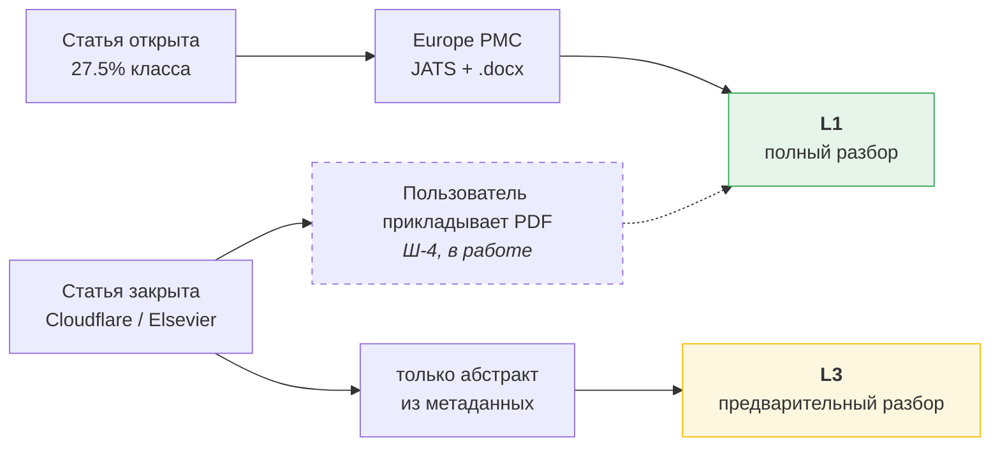

# 07 · Архитектура

Документ-артефакт подачи (требование S4). Диаграмма ниже рендерится прямо на GitHub;
экспорт в PNG для Devpost — `docs/img/architecture.png`.

Правило этого файла: диаграмма отражает **то, что работает**, а не то, что задумано.
Каждый блок соответствует существующему модулю; пунктиром показано то, что ещё не
сделано, и это подписано явно.

---

## Общая схема

```mermaid
flowchart LR
    DOI(["DOI"]) --> L0
    PDF(["Приложенный PDF<br/><i>путь B — Ш-4, в работе</i>"]) -.-> L0

    L0["<b>L0</b><br/>pipeline.py<br/>оркестратор"]

    L0 --> EPMC
    L0 --> SUP
    L0 --> UPW

    subgraph L1G["L1 · retrieval.py — добыча"]
        EPMC["Europe PMC REST<br/>метаданные + JATS"]
        SUP["supplementaryFiles<br/>.docx приложений"]
        UPW["Unpaywall<br/>запасной канал"]
        LVL{{"assess_level<br/>что реально достали<br/>→ L1 / L2 / L3"}}
        EPMC --> LVL
        SUP --> LVL
        UPW --> LVL
    end

    subgraph L2G["L2 · разбор таблиц"]
        JATS["jats_tables.py<br/>colspan / rowspan<br/>составные заголовки"]
        DOCX["docx_tables.py<br/>w:tbl / w:tr / w:tc"]
    end

    LVL --> JATS
    LVL --> DOCX

    JATS --> L3
    DOCX --> L3

    L3["<b>L3 · critic.py</b><br/>Gemini 3.7 Flash<br/>Vertex AI · global<br/>ROBINS-E, 7 доменов<br/>temperature 0"]
    L3 --> L4
    L4["<b>L4 · verify_numbers.py</b><br/>каждое число —<br/>обратно в источник<br/>сверка меток групп<br/>→ GROUP_MISMATCH"]
    L4 --> L5
    L5["<b>L5 · stats_tool.py</b><br/>E-value, ARR, NNT, RR CI<br/><i>вычисляются,<br/>не генерируются</i>"]
    L5 --> OUT
    OUT["<b>Отчёт</b><br/>уровень<br/>+ находки по 7 доменам<br/>+ протокол сверки чисел"]

    OUT --> SVC
    OUT --> JOB

    subgraph L6["L6 · выполнение в облаке"]
        SVC["Cloud Run<br/><code>POST /analyze</code><br/>синхронно, ~34 с"]
        JOB["Cloud Run Job<br/>корпус, 3 воркера<br/>фоново"]
        GCS[("GCS<br/>объект на статью")]
        JOB --> GCS
        GCS -.->|"GET /runs/{id}"| SVC
    end

    style L3 fill:#e8f0fe,stroke:#4285f4,stroke-width:2px
    style L4 fill:#fce8e6,stroke:#ea4335,stroke-width:2px
    style L5 fill:#e6f4ea,stroke:#34a853,stroke-width:2px
    style OUT fill:#fef7e0,stroke:#fbbc04,stroke-width:2px
    style PDF stroke-dasharray: 5 5
```

---

## Что на схеме важно и почему именно так

### Уровень определяется добычей, а не назначается

`assess_level` в конце слоя 1 — не украшение, а несущая конструкция. Он смотрит, что
физически удалось достать, и присваивает уровень, который **ограничивает максимально
допустимую уверенность** всего отчёта:

| Уровень | Что достали | Потолок уверенности |
|---|---|---|
| L1 | full-text + таблицы приложения | `CONFIRMED` |
| L2 | полный текст без приложений | `PLAUSIBLE` / `UNVERIFIED` |
| L3 | только абстракт | `PLAUSIBLE` / `UNVERIFIED` |

Обоснование потолка — замеренное, а не выбранное: ошибка направления confounding
держится и на L2 (F-26). Система, которая на абстракте называет находку подтверждённой,
врёт по построению — поэтому `CONFIRMED` ниже L1 недостижим структурно.

### Верификатор стоит **после** модели, а не внутри неё

Красный блок L4 — главное архитектурное решение проекта.

Попросить модель проверить саму себя — значит спросить второе мнение у того же
процесса. Слой 4 берёт каждое число, которое модель написала в отчёте, находит его в
добытом источнике вместе с окружающим контекстом и **сравнивает метки групп**. Поэтому
он ловит не только выдуманное значение (`UNVERIFIED`), но и подменённое направление
(`GROUP_MISMATCH`) — когда число настоящее, а приписано не той группе.

Это ровно тот дефект, который проект ищет в чужих работах. Он был допущен и внутри
проекта — в нашем собственном эталоне (F-12), — и найден инструментом, а не глазами.

### Статистика вычисляется, а не генерируется

Зелёный блок L5 не обращается к модели вообще. E-value, ARR, NNT и доверительные
интервалы считает `stats_tool.py`, который самопроверяется при импорте. Модель не
просят делать арифметику — ветки `computed` и `arithmetic` намеренно исключены из
сверки чисел, потому что проверять их надо не поиском по тексту, а пересчётом.

### Два режима исполнения, одно ядро

Cloud Run и Cloud Run Job — две оболочки над одним `pipeline.run`. Синхронный путь
отвечает за демонстрируемость (34 секунды на статью), фоновый — за то, что просит
хакатон: работа над корпусом без человека в цикле. Результат каждой статьи пишется в
GCS отдельным объектом, поэтому упавшая статья не уносит прогон.

---

## Путь A и путь B

Покрытие измерено на выборке из 40 статей класса (F-21, F-24, F-25): Europe PMC отдаёт
full-text для 27.5%, и там, где отдаёт, приложения приходят в 9 случаях из 11 — всегда
`.docx`, PDF ни разу. Добавление прямых PDF у издателей, публикующих машиночитаемый
указатель `citation_pdf_url`, доводит автоматическую добычу примерно до 55%. Остальное
— за Cloudflare (13 из 34) и у Elsevier за TDM-токеном; защиту сайтов не обходим.

Отсюда путь B: пользователю статья часто доступна лично, даже когда она недоступна
машине. Приложенный PDF даёт те же данные, что JATS + `.docx`, и должен давать тот же
уровень L1.

---

## Чего на схеме нет

Честный список, чтобы диаграмма не обещала больше кода:

- **ADK-обёртки нет.** Требование R2 закрыто через `google-genai` SDK; оркестратор
  свой (`pipeline.py`). Переход на ADK — резерв Р-1 в `TODO.md`.
- **Суб-агентов нет.** Замер даёт прямой аргумент за них (F-26: при росте объёма входа
  проседает отдельный пункт P4), но в текущей сборке критик один.
- **Memory Bank не подключён** — Q-11 открыт.
- **Document AI не подключён** — Q-08 открыт, решится в Ш-4, если локальный разбор
  PDF-таблиц не справится.
